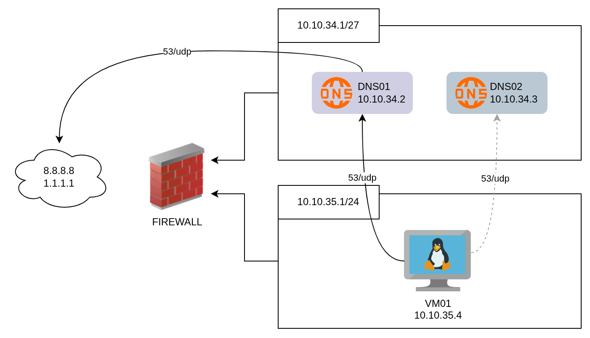

BIND9 (Berkeley Internet Name Domain versión 9) es el servidor de DNS (Sistema de Nombres de Dominio) más utilizado en Internet, especialmente en sistemas Unix y GNU/Linux, donde es un estándar de facto.

En este post se describirán los pasos necesarios para poder hacer un despliegue de una solucion DNS master worker utilizando maquinas virtuales con ***almalinux 8*** como referencia se utilizo el siguiente tutorial: [Install and Configure BIND 9 Master and Slave DNS Server for Local Network using AlmaLinux 9](https://www.youtube.com/watch?v=4yKN9r48vo0)

## Escenario

Se crearan dos servidores DNS uno que sea el principal y otro que sea de failback, estos se despliegan en una subred exclusiva para el servicio de DNS, para poder hacer uso de esta solucion, en una subred diferente, se deplegará un servidor linux que servirá para poder hacer pruebas.

Ademas se creará una zona (lab.test)




## Instalacion

En cada servidor de DNS se deben ejecutar los siguientes comandos:

### Actualizar los paquetes

Para garantizar que los repositorios tengan los paquetes inicialmente se debe actualizar los paquetes con el comando:

```bash
sudo yum -y update
```

### Instalar bind9

Teniendo los repositorioas actualizados se procede a instalar lo paquetes necesarios para desplegar el servicio:

```bash
sudo yum install -y bind bind-utils
```

### Habilitar el servicio

Para finalizar, se debe habilitar el servicio de esta manera se ejecutará desde que se enciendan las maquinas:

```bash
sudo systemctl enable named --now
```

## Configuracion

Ya instalo el servicio en cada uno de los servidores DNS se procede a configuralos. Para cada uno de los roles se debe hacer una configuracion distinta.

### Servidor Master

#### Configuracion Querys

En este servidor se van a realizar la mayor cantidad de configuraciones. inicialmente se debe moficiar el archivo **/etc/named.conf**.

Dentro del archivo se debe crear una ***acl*** para todas las subredes, por facilidad se coloca al inicio del archivo

```conf

acl  vms{
    10.10.35.1/24;
};

```

Despues en la seccion options se debe configurar el siguiente dns que se va a consultar en caso que no encuentre el registro, se agrega la llave ***forwarders***

```conf
options {
    forwarders {
        8.8.8.8;
        1.1.1.1;
    };
...
};
```

Para que se puedan hacer solcitudes a este DNS se debe modificar la llave ***listen-on port 53***  y  ***allow-query*** agregando los acls, en este caso  las acls seran:

+ **vms** : creado explicitamente
+ **localnets**:  coincide automáticamente con las direcciones IP y máscaras de subred de todas las interfaces de red del servidor donde BIND está ejecutándose.


```conf
options {
    ...
    listen-on port 53 { vms; localnets; };
    ...
    allow-query {  vms; localnets;   };
...
};
```
Por ultimo para garantizar que se pueda hacer una copi de las zonas al DNS workers, se debe agregar la llave ***allow-transfer***, con la ip del DNS secundario


```conf
options {
    ...
   allow-transfer {10.10.34.3/32;};
...
};
```

#### Configuracion Zonas

Para crear una nueva zona se debe crear los archivos forward y reverse:

+ **forward** (o zona directa) contiene los registros que permiten resolver nombres de dominio en direcciones IP
+ **reverse** (o zona inversa) se utiliza para resolver direcciones IP en nombres de dominio, lo cual es esencial para funciones como la verificación de correo electrónico o el diagnóstico de redes.

Se inicia editando el archivo ***/etc/named.rfc1912.zones***:


1. se agrega la zona forward, ya que este es el nodo master tiene un *type* tipo master

```conf
...
zone "lab.test" {
	type master;
	file "/var/named/forward.lab.test";
	allow-update {none; };
};
```
2. Se agregan las zonas reverse, ya que en este caso tenemos dos subredes se crean dos zonas reversas: 

```conf
...

zone "34.10.10.in-addr.arpa" {
	type master;
	file "/var/named/reverse.lab.test";
	allow-update {none; };
};

zone "35.10.10.in-addr.arpa" {
	type master;
	file "/var/named/reverse-vms.lab.test";
	allow-update {none; };
};

```
Para poder garantizar que las configuraciones son correctas se ejecuta el siguiente comando (no debe retornar ningun error)

```bash
sudo named-checkconf
```

Se procede a crear los archivos para las zonas:

***/var/named/forward.lab.test***

```conf
$TTL    2d              ; TTL por defecto para la zona
@       IN      SOA     ns1.lab.test. root.lab.test. (
                        2003080800      ; serial
                        43200           ; refresh (12h)
                        900             ; retry (15m)
                        1814400         ; expiry (3w)
                        7200            ; minimum (2h)
                        )

; Servidores de nombres
@       IN      NS      ns1.lab.test.
@       IN      NS      ns2.lab.test.

; Registros A para los nameservers
ns1     IN      A       10.10.34.2
ns2     IN      A       10.10.34.3
; Registro de la VM01
vm1     IN      A       10.10.35.4
```

***/var/named/reverse.lab.test***

```conf
$TTL 1D
@        IN        SOA  ns1.lab.test. root.lab.test. (
                        2007091701 ; serial
                        30800      ; refresh
                        7200       ; retry
                        604800     ; expire
                        300 )      ; minimum
@	IN	NS	ns1.lab.test.
@   IN	NS	ns2.lab.test.

2	IN	PTR	ns1.lab.test.
3	IN 	PTR	ns2.lab.test.
```

***/var/named/reverse-vms.lab.test***

```conf
$TTL 1D
@        IN        SOA  ns1.lab.test. root.lab.test. (
                        2007091701 ; serial
                        30800      ; refresh
                        7200       ; retry
                        604800     ; expire
                        300 )      ; minimum
@	IN	NS	ns1.lab.test.
@   IN	NS	ns2.lab.test.

4	IN	PTR	vm1.lab.test.
```

Se corren los siguientes comandos para validar que las zonas este bien creadas

```bash
sudo named-checkzone lab.test /var/named/forward.lab.test
sudo named-checkzone reverse.lab.test /var/named/reverse.lab.test
sudo named-checkzone  reverse-vms.lab.test /var/named/reverse-vms.lab.test
```

Asumiendo que no se tengan errores en la configuracion se procede a reiniciar el servicio:

```bash
sudo systemctl restart named
```

### Servidor Worker

Para poder configurar la replica de las zonas se deben modificar los archivos **/etc/named.conf** y ***/etc/named.rfc1912.zones***.

En el archivo **/etc/named.conf** se debe crear el ***acl*** la llave ***forwarders*** , y modificar ***listen-on port 53***  y  ***allow-query*** igual que en el master. **Pero no se debe agregar la llave  allow-transfer**


```conf

acl  vms{
    10.10.35.1/24;
};


options {
    forwarders {
        8.8.8.8;
        1.1.1.1;
    };
    listen-on port 53 { vms; localnets; };
    ...
    allow-query {  vms; localnets;   };
...
};
```
Por otro lado se deben enalzar las zonas agregandolas en el archivo ***/etc/named.rfc1912.zones***, pero esta vez el *type* será slave y envez de la opcion ***allow-update*** se debe agregar ***masters*** con la ip del servidor dns maestro.


```conf
...

zone "lab.test" {
	type slave;
	file "/var/named/forward.lab.test";
	masters {10.10.34.2;};
};

zone "34.10.10.in-addr.arpa" {
	type slave;
	file "/var/named/reverse.lab.test";
	masters {10.10.34.2;};
};

zone "35.10.10.in-addr.arpa" {
	type slave;
	file "/var/named/reverse-vms.lab.test";
	masters {10.10.34.2;};
};

```

Se hace una verificacion de la configuracion

```bash
sudo named-checkconf
```

Asumiendo que no se tengan errores en la configuracion se procede a reiniciar el servicio:

```bash
sudo systemctl restart named
```

## Configuracion del DNS on la VM de prueba

Se modifica el archivo ***/etc/resolv.conf*** referenciando las ips de los dos servidores DNS

```conf
nameserver 10.10.34.2
nameserver 10.10.34.3
```

Se realizan pruebas haciendo solicitudes tanto por nombre como por ip

```bash
nslookup ns1.lab.test # retorna la ip
nslookup 10.10.34.2 # retorna el nombre
```