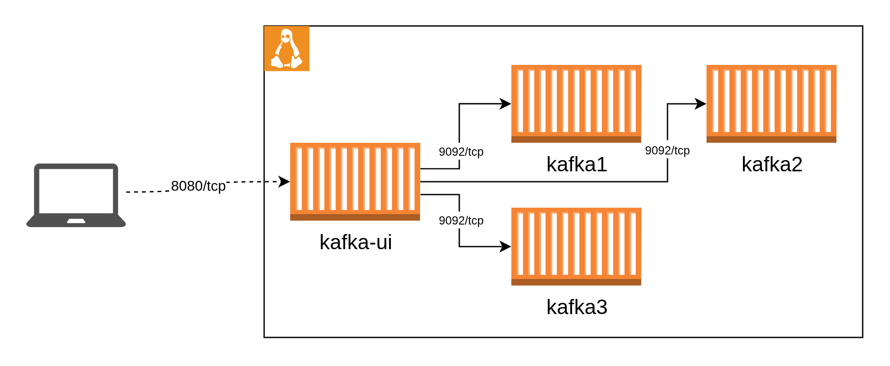

Kafka es la solución de streaming que la mayoría de los equipos de analítica están migrando para centralizar, normalizar y consumir datos en tiempo real. Para validar hipótesis, probar pipelines o entrenar modelos de ML, suele ser ventajoso poder levantar un cluster de Kafka de forma local, con la misma configuración que tendrá en producción pero sin la sobrecarga de Kubernetes ni de servicios en la nube.

# Arquitectura

En este post te mostramos paso a paso cómo crear un clúster de tres brokers con Docker Compose sobre una sola VM. El resultado es un entorno reproducible, con persistencia y listo para que lo utilices como punto de partida en tus proyectos de analítica.

Es importante mencionar que no se utilizará zookeper para la orquestacion, en cambio se desplegará en `KRaft mode`. por otro lado se utilizará el sevicio `kafka-ui` para poder explorar el cluster de una manera mas visual.

Esta configuracion fue tomada de [Setting Up a Kafka Cluster Using Docker Compose(Kraft Mode): A Step-by-Step Guide](https://medium.com/@darshak.kachchhi/setting-up-a-kafka-cluster-using-docker-compose-a-step-by-step-guide-a1ee5972b122)




# Despliegue

## 1. Configurar carpetas

Para garantizar que el cluster tenga persistencia es necesario antes de desplegarlo crear carpetas que se asociarán a los contenedores.

```bash
mkdir -p /opt/kafka1/data /opt/kafka2/data /opt/kafka3/data
```

## 2. Crear archivo de configuracion

Para que funcione el cluster es necesario suministrar un id para el cluster. se debe crear en la carpeta un archivo `.env` con la siguiente variable

```
CLUSTER_ID=<ID_CLUSTER>
```

## 3. Docker compose

En la carpeta de trabajo se debe crear un archivo `docker-compose.yml` con la siguiente informacion:

```bash
networks:
  kafka-net:
    driver: bridge

services:
  kafka1:
    image: confluentinc/cp-kafka:7.8.0
    hostname: kafka1
    container_name: kafka1
    ports:
      - "9092:9092"
      - "9093:9093"
    environment:
      KAFKA_NODE_ID: 1
      KAFKA_BROKER_ID: 1
      KAFKA_PROCESS_ROLES: 'broker,controller'
      KAFKA_CONTROLLER_QUORUM_VOTERS: '1@kafka1:9093,2@kafka2:9093,3@kafka3:9093'
      KAFKA_LISTENERS: 'PLAINTEXT://kafka1:9092,CONTROLLER://kafka1:9093'
      KAFKA_ADVERTISED_LISTENERS: 'PLAINTEXT://kafka1:9092'
      KAFKA_LISTENER_SECURITY_PROTOCOL_MAP: 'CONTROLLER:PLAINTEXT,PLAINTEXT:PLAINTEXT'
      KAFKA_CONTROLLER_LISTENER_NAMES: 'CONTROLLER'
      KAFKA_INTER_BROKER_LISTENER_NAME: 'PLAINTEXT'
      CLUSTER_ID: ${CLUSTER_ID}
      KAFKA_OFFSETS_TOPIC_REPLICATION_FACTOR: 3
      KAFKA_GROUP_INITIAL_REBALANCE_DELAY_MS: 0
      KAFKA_DEFAULT_REPLICATION_FACTOR: 3
      KAFKA_MIN_INSYNC_REPLICAS: 2
    volumes:
      - ./kafka1/data:/var/lib/kafka/data
    networks:
      - kafka-net

  kafka2:
    image: confluentinc/cp-kafka:7.8.0
    hostname: kafka2
    container_name: kafka2
    ports:
      - "9094:9092"
      - "9095:9093"
    environment:
      KAFKA_NODE_ID: 2
      KAFKA_BROKER_ID: 2
      KAFKA_PROCESS_ROLES: 'broker,controller'
      KAFKA_CONTROLLER_QUORUM_VOTERS: '1@kafka1:9093,2@kafka2:9093,3@kafka3:9093'
      KAFKA_LISTENERS: 'PLAINTEXT://kafka2:9092,CONTROLLER://kafka2:9093'
      KAFKA_ADVERTISED_LISTENERS: 'PLAINTEXT://kafka2:9092'
      KAFKA_LISTENER_SECURITY_PROTOCOL_MAP: 'CONTROLLER:PLAINTEXT,PLAINTEXT:PLAINTEXT'
      KAFKA_CONTROLLER_LISTENER_NAMES: 'CONTROLLER'
      KAFKA_INTER_BROKER_LISTENER_NAME: 'PLAINTEXT'
      CLUSTER_ID: ${CLUSTER_ID}
      KAFKA_OFFSETS_TOPIC_REPLICATION_FACTOR: 3
      KAFKA_GROUP_INITIAL_REBALANCE_DELAY_MS: 0
      KAFKA_DEFAULT_REPLICATION_FACTOR: 3
      KAFKA_MIN_INSYNC_REPLICAS: 2
    volumes:
      - ./kafka2/data:/var/lib/kafka/data
    networks:
      - kafka-net

  kafka3:
    image: confluentinc/cp-kafka:7.8.0
    hostname: kafka3
    container_name: kafka3
    ports:
      - "9096:9092"
      - "9097:9093"
    environment:
      KAFKA_NODE_ID: 3
      KAFKA_BROKER_ID: 3
      KAFKA_PROCESS_ROLES: 'broker,controller'
      KAFKA_CONTROLLER_QUORUM_VOTERS: '1@kafka1:9093,2@kafka2:9093,3@kafka3:9093'
      KAFKA_LISTENERS: 'PLAINTEXT://kafka3:9092,CONTROLLER://kafka3:9093'
      KAFKA_ADVERTISED_LISTENERS: 'PLAINTEXT://kafka3:9092'
      KAFKA_LISTENER_SECURITY_PROTOCOL_MAP: 'CONTROLLER:PLAINTEXT,PLAINTEXT:PLAINTEXT'
      KAFKA_CONTROLLER_LISTENER_NAMES: 'CONTROLLER'
      KAFKA_INTER_BROKER_LISTENER_NAME: 'PLAINTEXT'
      CLUSTER_ID: ${CLUSTER_ID}
      KAFKA_OFFSETS_TOPIC_REPLICATION_FACTOR: 3
      KAFKA_GROUP_INITIAL_REBALANCE_DELAY_MS: 0
      KAFKA_DEFAULT_REPLICATION_FACTOR: 3
      KAFKA_MIN_INSYNC_REPLICAS: 2
    volumes:
      - ./kafka3/data:/var/lib/kafka/data
    networks:
      - kafka-net

  kafka-ui:
    image: provectuslabs/kafka-ui:latest
    container_name: kafka-cluster-ui
    ports:
      - "8080:8080"
    environment:
      KAFKA_CLUSTERS_0_NAME: local
      KAFKA_CLUSTERS_0_BOOTSTRAPSERVERS: kafka1:9092,kafka2:9092,kafka3:9092
    depends_on:
      - kafka1
      - kafka2
      - kafka3
    networks:
      - kafka-net
```

## 4. Iniciar el cluster

```bash
docker compose up -d
```

## 5. Validar la instalacion

Es posible validar el despliegue utilizando el contendor **kafka-ui** que en este caso se va exponer en el puerto `8080`

